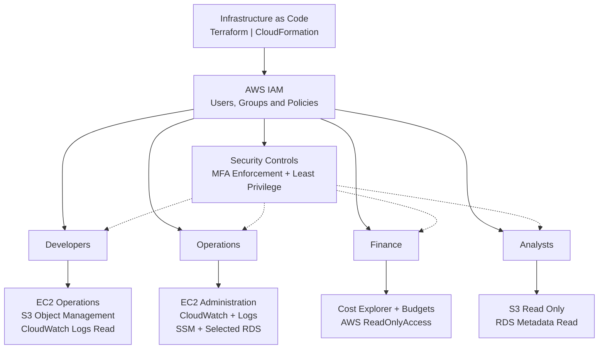

```mermaid
flowchart TB
    IAC["Infrastructure as Code<br/>Terraform | CloudFormation"]
    IAM["AWS IAM<br/>Users, Groups and Policies"]
    MFA["Security Controls<br/>MFA Enforcement + Least Privilege"]

    DEV["Developers"]
    OPS["Operations"]
    FIN["Finance"]
    ANA["Analysts"]

    DRES["EC2 Operations<br/>S3 Object Management<br/>CloudWatch Logs Read"]
    ORES["EC2 Administration<br/>CloudWatch + Logs<br/>SSM + Selected RDS"]
    FRES["Cost Explorer + Budgets<br/>AWS ReadOnlyAccess"]
    ARES["S3 Read Only<br/>RDS Metadata Read"]

    IAC --> IAM
    IAM --> MFA
    IAM --> DEV
    IAM --> OPS
    IAM --> FIN
    IAM --> ANA

    MFA -.-> DEV
    MFA -.-> OPS
    MFA -.-> FIN
    MFA -.-> ANA

    DEV --> DRES
    OPS --> ORES
    FIN --> FRES
    ANA --> ARES
```
